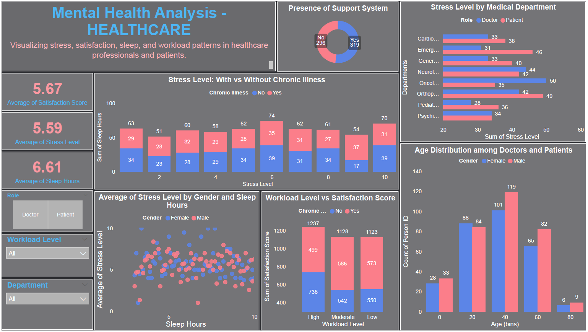

# 📦 Mental Health Analysis - Healthcare Dashboard
- A Power BI dashboard project that explores mental health patterns in the Indian healthcare sector. This project uses synthetic data generated using Python to analyze key factors such as stress levels, sleep duration, workload intensity, satisfaction, and support systems among doctors and patients.

## 📁 Dashboard Contents
- ✅ Average Satisfaction Score (Role-wise & Department-wise)
- 😴 Average Sleep Hours (Compared with stress & support availability)
- 😥 Average Stress Level (Across roles, chronic illness, workload)
- 🏥 Department-Wise Analysis (Cardiology, Neurology, etc.)
- 🤝 Support System Impact on Mental Health
- 📈 Interactive Filters for Role, Department, Workload Level, and Age Groups

## 💡 Tools & Technologies  
- 🐍 Python (Pandas) – for dummy dataset generation
- 📊 Microsoft Power BI – for data visualization
- 📁 CSV – for dataset format

## 🔗 Live GitHub Page
👉 [View Project Page](https://harshad912004.github.io/Mental_Health_Analysis-Healthcare/)

## 🖼️ Preview

## 📥 Download  
- Mental_Health_Analysis-Healthcare.pbix – Power BI File
- Mental_Health_Analysis-Healthcare.pdf – Dashboard PDF Export
- Healthcare_Dataset.csv – Synthetic Dataset

## 👨‍💻 Author  
**Harshad Dhongade**  
MCA Student | Aspiring Data Analyst | Passionate about solving real-world problems through data.

---
